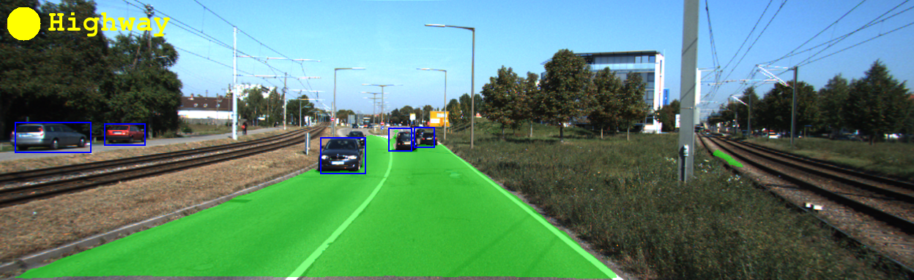
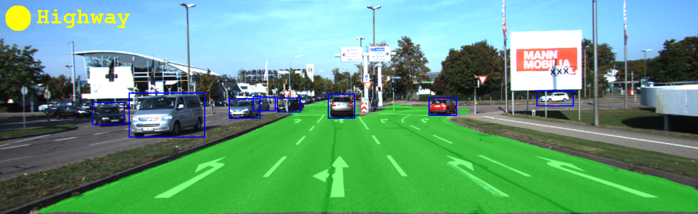
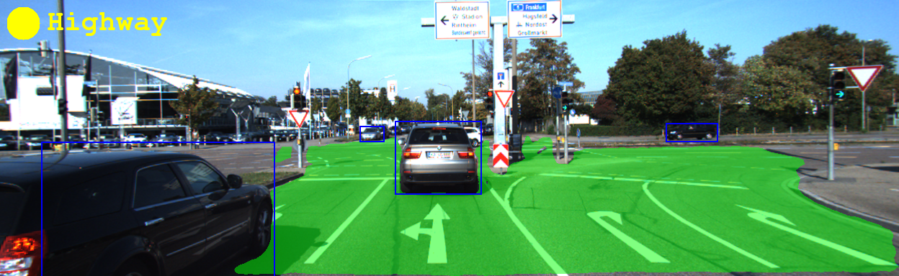
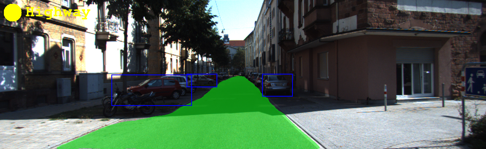
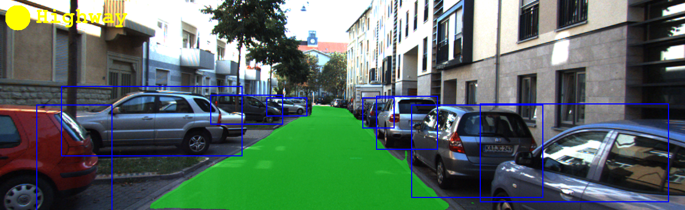

# MultiNet

MultiNet is able to jointly perform road segmentation, car detection and street classification. The model archives real-time speed and [state-of-the-art](http://www.cvlibs.net/datasets/kitti/eval_road_detail.php?result=ca96b8137feb7a636f3d774c408b1243d8a6e0df)  performance in segmentation. Check out our [paper](https://arxiv.org/abs/1612.07695) for a detailed model description.

   

   

MultiNet is optimized to perform well at a real-time speed. Its ingredient [KittiSeg](https://github.com/MarvinTeichmann/KittiSeg#kittiseg) sets a new state-of-the art in road segmentation and [KittiBox](https://github.com/MarvinTeichmann/KittiBox#kittibox) improves over the baseline Faster-RCNN in both inference speed and detection performance.


The model is designed as an encoder-decoder architecture. It utilizes one VGG encoder and several independend decoders for each task. This repository contains generic code allowing to combine several tensorflow models in one network. The code for the indevidual tasks is provided by the [KittiSeg](https://github.com/MarvinTeichmann/KittiSeg#kittiseg), [KittiBox](https://github.com/MarvinTeichmann/KittiBox#kittibox) and [KittiClass](https://github.com/MarvinTeichmann/KittiClass) repository. Those repositories are utilized as [submodule](https://github.com/MarvinTeichmann/MultiNet/tree/master/submodules) in this project. This project is build to be compatible with the [TensorVision](http://tensorvision.readthedocs.io/en/master/user/tutorial.html#workflow) back end which allows to organize experiments in a very clean way. 

## Requirements

The code requires [Tensorflow 1.0](https://www.tensorflow.org/install/) as well as the following python libraries: 

* matplotlib
* numpy
* Pillow
* scipy
* runcython
* commentjson

Those modules can be installed using: `pip install numpy scipy pillow matplotlib runcython commentjson` or `pip install -r requirements.txt`.


## Setup

1. Clone this repository: `https://github.com/MarvinTeichmann/MultiNet.git`
2. Initialize all submodules: `git submodule update --init --recursive`
3. 'cd submodules/KittiBox/submodules/utils/ && make to build cython code
4. [Optional] Download Kitti Road Data:
    1. Retrieve kitti data url here: [http://www.cvlibs.net/download.php?file=data_road.zip](http://www.cvlibs.net/download.php?file=data_road.zip)
    2. Call `python download_data.py --kitti_url URL_YOU_RETRIEVED`
5. [Optional] Run `cd submodules/KittiBox/submodules/KittiObjective2/ && make` to build the Kitti evaluation code (see [submodules/KittiBox/submodules/KittiObjective2/README.md](https://github.com/MarvinTeichmann/KittiBox/blob/1073ab1ef6c53adc78c5340f42ce3468797d50b4/submodules/KittiObjective2/README.md) for more information)
    
Running the model using `demo.py` only requires you to perform step 1-3. Step 4 and 5 is only required if you want to train your own model using `train.py`. Also note, that I recommend using `download_data.py` instead of downloading the data yourself. The script will also extract and prepare the data. See Section [Manage data storage](README.md#manage-data-storage) if you like to control where the data is stored.

## Tutorial

### Getting started

Run: `python demo.py --gpus 0 --input data/demo/um_000005.png` to obtain a prediction using [demo.png](data/demo/um_000005.png) as input.

Run: `python evaluate.py` to evaluate a trained model. 

Run: `python train.py --hypes hypes/multinet2.json` to train a multinet2

If you like to understand the code, I would recommend looking at [demo.py](demo.py) first. I have documented each step as thoroughly as possible in this file. 

Only training of MultiNet3 (joint detection and segmentation) is supported out of the box. The data to train the classification model is not public an those cannot be used to train the full MultiNet3 (detection, segmentation and classification). The full code is given here, so you can still train MultiNet3 if you have your own data.

##### To update MultiNet do:

1. Pull all patches: `git pull`
2. Update all submodules: `git submodule update --init --recursive`

If you forget the second step you might end up with an inconstant repository state. You will already have the new code for MultiNet but run it old submodule versions code. This can work, but I do not run any tests to verify this.


### Manage Data Storage

MultiNet allows to separate data storage from code. This is very useful in many server environments. By default, the data is stored in the folder `MultiNet/DATA` and the output of runs in `MultiNet/RUNS`. This behaviour can be changed by setting the bash environment variables: `$TV_DIR_DATA` and `$TV_DIR_RUNS`.

Include  `export TV_DIR_DATA="/MY/LARGE/HDD/DATA"` in your `.profile` and the all data will be downloaded to `/MY/LARGE/HDD/DATA/`. Include `export TV_DIR_RUNS="/MY/LARGE/HDD/RUNS"` in your `.profile` and all runs will be saved to `/MY/LARGE/HDD/RUNS/MultiNet`

### Modifying Model & Train on your own data

The model is controlled by the file `hypes/multinet3.json`. This file points the code to the implementation of the submodels. The MultiNet code then loads all models provided and integrades the decoders into one neuronal network. To train on your own data, it should be enough to modify the hype files of the submodels. A good start will be the [KittiSeg](https://github.com/MarvinTeichmann/KittiSeg#kittiseg), which is very well documented.

```
    "models": {
        "segmentation" : "../submodules/KittiSeg/hypes/KittiSeg.json",
        "detection" : "../submodules/KittiBox/hypes/kittiBox.json",
        "road" : "../submodules/KittiClass/hypes/KittiClass.json"
    },
```

### RUNDIR and Experiment Organization

MultiNet helps you to organize large number of experiments. To do so the output of each run is stored in its own rundir. Each rundir contains:

* `output.log` a copy of the training output which was printed to your screen
* `tensorflow events` tensorboard can be run in rundir
* `tensorflow checkpoints` the trained model can be loaded from rundir
* `[dir] images` a folder containing example output images. `image_iter` controls how often the whole validation set is dumped
* `[dir] model_files` A copy of all source code need to build the model. This can be very useful of you have many versions of the model.

To keep track of all the experiments, you can give each rundir a unique name with the `--name` flag. The `--project` flag will store the run in a separate subfolder allowing to run different series of experiments. As an example, `python train.py --project batch_size_bench --name size_5` will use the following dir as rundir:  `$TV_DIR_RUNS/KittiSeg/batch_size_bench/size_5_KittiSeg_2017_02_08_13.12`.

The flag `--nosave` is very useful to not spam your rundir.


## Useful Flags & Variabels

Here are some Flags which will be useful when working with KittiSeg and TensorVision. All flags are available across all scripts. 

`--hypes` : specify which hype-file to use <br>
`--logdir` : specify which logdir to use <br>
`--gpus` : specify on which GPUs to run the code <br>
`--name` : assign a name to the run <br>
`--project` : assign a project to the run <br>
`--nosave` : debug run, logdir will be set to `debug` <br>

In addition the following TensorVision environment Variables will be useful:

`$TV_DIR_DATA`: specify meta directory for data <br>
`$TV_DIR_RUNS`: specify meta directory for output <br>
`$TV_USE_GPUS`: specify default GPU behaviour. <br>

On a cluster it is useful to set `$TV_USE_GPUS=force`. This will make the flag `--gpus` mandatory and ensure, that run will be executed on the right GPU.

# Citation

If you benefit from this code, please cite our paper:

```
@article{teichmann2016multinet,
  title={MultiNet: Real-time Joint Semantic Reasoning for Autonomous Driving},
  author={Teichmann, Marvin and Weber, Michael and Zoellner, Marius and Cipolla, Roberto and Urtasun, Raquel},
  journal={arXiv preprint arXiv:1612.07695},
  year={2016}
}
```

